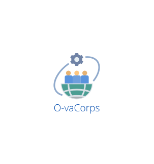
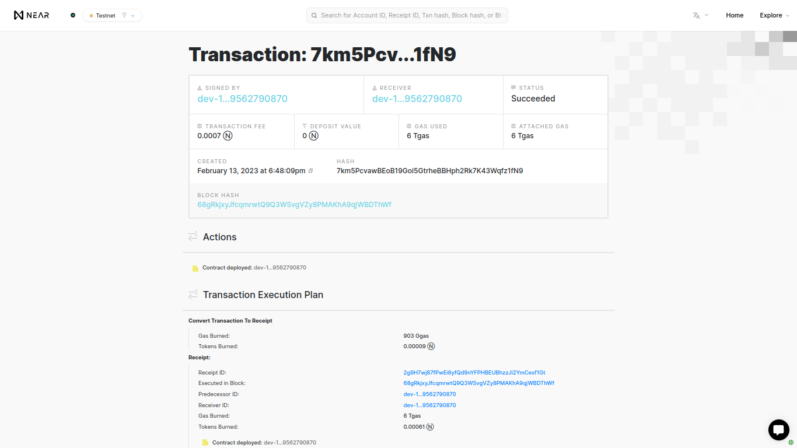
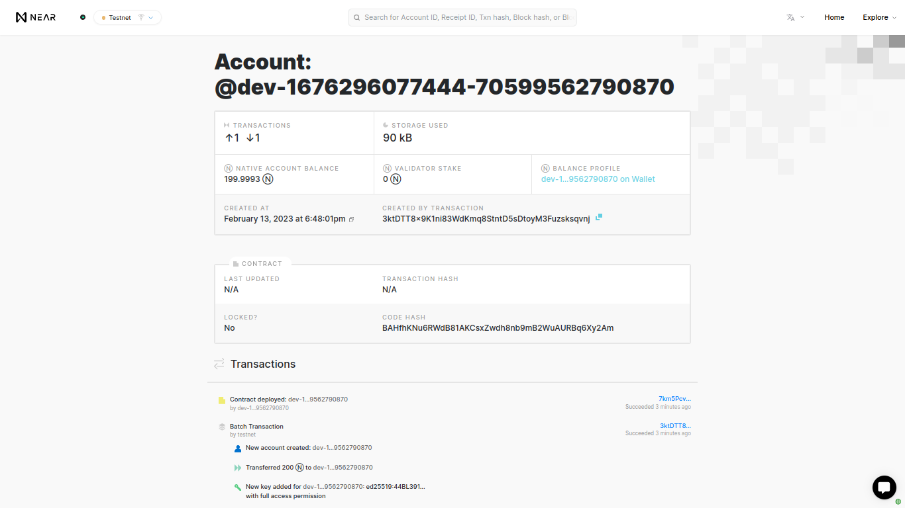
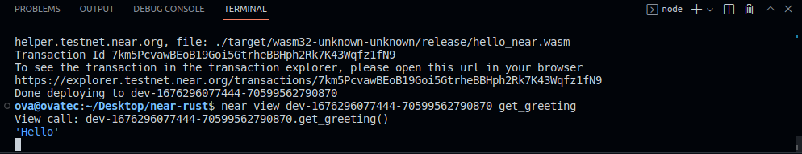
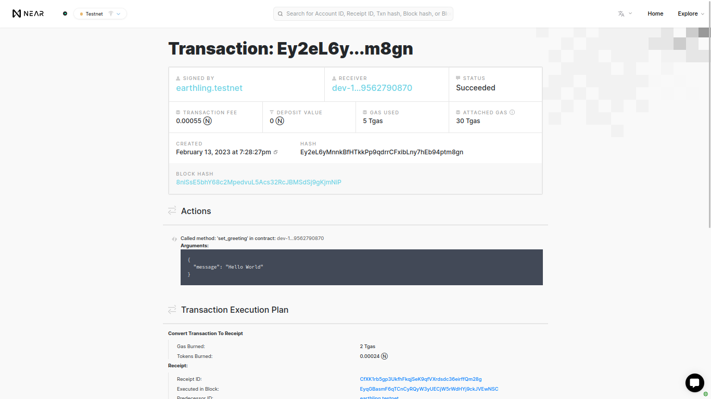
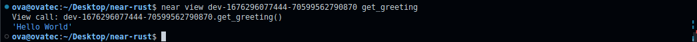

<!--
HOW TO USE:
This is an example of how you may give instructions on setting up your project locally.

Modify this file to match your project and remove sections that don't apply.

REQUIRED SECTIONS:
- Table of Contents
- About the Project
  - Built With
  - Live Demo
- Getting Started
- Authors
- Future Features
- Contributing
- Show your support
- Acknowledgements
- License

After you're finished please remove all the comments and instructions!
-->

  
   

  <h3><b>README Template</b></h3>

<!-- TABLE OF CONTENTS -->

# 📗 Table of Contents

- [📖 About the Project](#about-project)
  - [🛠 Built With](#built-with)
    - [Tech Stack](#tech-stack)
    - [Key Features](#key-features)
  - [🚀 Live Demo](#live-demo)
- [💻 Getting Started](#getting-started)
  - [Setup](#setup)
  - [Prerequisites](#prerequisites)
  - [Install](#install)
  - [Usage](#usage)
  - [Run tests](#run-tests)
  - [Deployment](#triangular_flag_on_post-deployment)
- [👥 Authors](#authors)
- [🔭 Future Features](#future-features)
- [🤝 Contributing](#contributing)
- [⭐️ Show your support](#support)
- [🙏 Acknowledgements](#acknowledgements)
- [❓ FAQ](#faq)
- [📝 License](#license)

<!-- PROJECT DESCRIPTION -->

# 📖 [your_project_name] 

> Describe your project in 1 or 2 sentences.

Near-Rust is a...

## 🛠 Built With 

### Tech Stack 

> Describe the tech stack and include only the relevant sections that apply to your project.

  
Client

  <ul>
    <li><a href="">create-near-app</a></li>
  </ul>

  
Server

  <ul>
    <li><a href="">Localhost</a></li>
  </ul>

Database

  <ul>
    <li><a href="">Near Blockchain</a></li>
  </ul>

<!-- Features -->

### Key Features 

> Describe between 1-3 key features of the application.

- **[key_feature_1]**
- **[key_feature_2]**
- **[key_feature_3]**

(<a href="#readme-top">back to top</a>)

<!-- LIVE DEMO -->

## 🚀 Live Demo 

> Add a link to your deployed project.

(<a href="#readme-top">back to top</a>)

<!-- GETTING STARTED -->

## 💻 Getting Started 

==================

This app was initialized with [create-near-app]

Quick Start
===========

If you haven't installed dependencies during setup:

    npm install

Build and deploy your contract to TestNet with a temporary dev account:

    npm run deploy

Test your contract:

    npm test

If you have a frontend, run `npm start`. This will run a dev server.

Exploring The Code
==================

1. The smart-contract code lives in the `/contract` folder. See the README there for
   more info. In blockchain apps the smart contract is the "backend" of your app.
2. The frontend code lives in the `/frontend` folder. `/frontend/index.html` is a great
   place to start exploring. Note that it loads in `/frontend/index.js`,
   this is your entrypoint to learn how the frontend connects to the NEAR blockchain.
3. Test your contract: `npm test`, this will run the tests in `integration-tests` directory.

Deploy
======

Every smart contract in NEAR has its [own associated account][NEAR accounts]. 
When you run `npm run deploy`, your smart contract gets deployed to the live NEAR TestNet with a temporary dev account.
When you're ready to make it permanent, here's how:

Step 0: Install near-cli (optional)
-------------------------------------

[near-cli] is a command line interface (CLI) for interacting with the NEAR blockchain. It was installed to the local `node_modules` folder when you ran `npm install`, but for best ergonomics you may want to install it globally:

    npm install --global near-cli

Or, if you'd rather use the locally-installed version, you can prefix all `near` commands with `npx`

Ensure that it's installed with `near --version` (or `npx near --version`)

Step 1: Create an account for the contract
------------------------------------------

Each account on NEAR can have at most one contract deployed to it. If you've already created an account such as `your-name.testnet`, you can deploy your contract to `near-blank-project.your-name.testnet`. Assuming you've already created an account on [NEAR Wallet], here's how to create `near-blank-project.your-name.testnet`:

1. Authorize NEAR CLI, following the commands it gives you:

      near login

2. Create a subaccount (replace `YOUR-NAME` below with your actual account name):

      near create-account near-blank-project.YOUR-NAME.testnet --masterAccount YOUR-NAME.testnet

Step 2: deploy the contract
---------------------------

Use the CLI to deploy the contract to TestNet with your account ID.
Replace `PATH_TO_WASM_FILE` with the `wasm` that was generated in `contract` build directory.

    near deploy --accountId near-blank-project.YOUR-NAME.testnet --wasmFile PATH_TO_WASM_FILE

Step 3: set contract name in your frontend code
-----------------------------------------------

Modify the line in `src/config.js` that sets the account name of the contract. Set it to the account id you used above.

    const CONTRACT_NAME = process.env.CONTRACT_NAME || 'near-blank-project.YOUR-NAME.testnet'

Troubleshooting
===============

On Windows, if you're seeing an error containing `EPERM` it may be related to spaces in your path. Please see [this issue](https://github.com/zkat/npx/issues/209) for more details.

  [create-near-app]: https://github.com/near/create-near-app
  [Node.js]: https://nodejs.org/en/download/package-manager/
  [jest]: https://jestjs.io/
  [NEAR accounts]: https://docs.near.org/concepts/basics/account
  [NEAR Wallet]: https://wallet.testnet.near.org/
  [near-cli]: https://github.com/near/near-cli
  [gh-pages]: https://github.com/tschaub/gh-pages

(<a href="#readme-top">back to top</a>)

<!-- AUTHORS -->

## 👥 Author 

👤 **OmarMWarraich**

- GitHub: [@OmarMWarraich](https://github.com/OmarMWarraich)
- Twitter: [@omarwarraich1](https://twitter.com/omarwarraich1)
- LinkedIn: [LinkedIn](https://linkedin.com/in/o-va)

(<a href="#readme-top">back to top</a>)

<!-- FUTURE FEATURES -->

## 🔭 Future Features 

> Describe 1 - 3 features you will add to the project.

- [ ] **[new_feature_1]**
- [ ] **[new_feature_2]**
- [ ] **[new_feature_3]**

(<a href="#readme-top">back to top</a>)

<!-- CONTRIBUTING -->

## 🤝 Contributing 

Contributions, issues, and feature requests are welcome!

Feel free to check the [issues page](../../issues/).

(<a href="#readme-top">back to top</a>)

<!-- SUPPORT -->

## ⭐️ Show your support 

> Write a message to encourage readers to support your project

If you like this project and want to support it, please consider giving it a ⭐️ on GitHub.

(<a href="#readme-top">back to top</a>)

<!-- ACKNOWLEDGEMENTS -->

## 🙏 Acknowledgments 

> Give credit to everyone who inspired your codebase.

I thank Allah Almighty the most merciful and the most forgiving for giving me the strength to complete this project.

(<a href="#readme-top">back to top</a>)

<!-- FAQ (optional) -->

## ❓ FAQ 

> Add at least 2 questions new developers would ask when they decide to use your project.

- **[Question_1]**

  - [Answer_1]

- **[Question_2]**

  - [Answer_2]

(<a href="#readme-top">back to top</a>)

<!-- LICENSE -->

## 📝 License 

This project is [MIT](./LICENSE) licensed.

(<a href="#readme-top">back to top</a>)

